# 操作指南

## 云联网实例管理

### 创建云联网实例

第一步：在控制台上点击【全部产品】--【网络】--【云联网】--【云联网实例】TAB页，进入云联网实例管理界面；

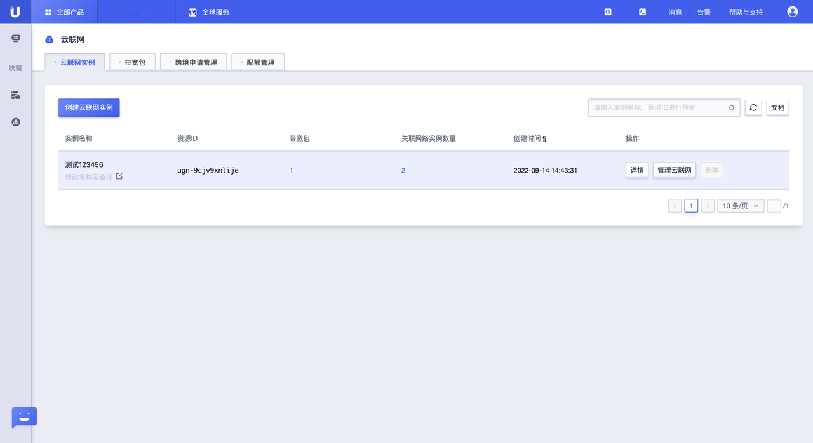


第二步：点击【创建云联网实例】，输入“实例名称”，关联相关网络实例，点击【确认】即可完成创建；

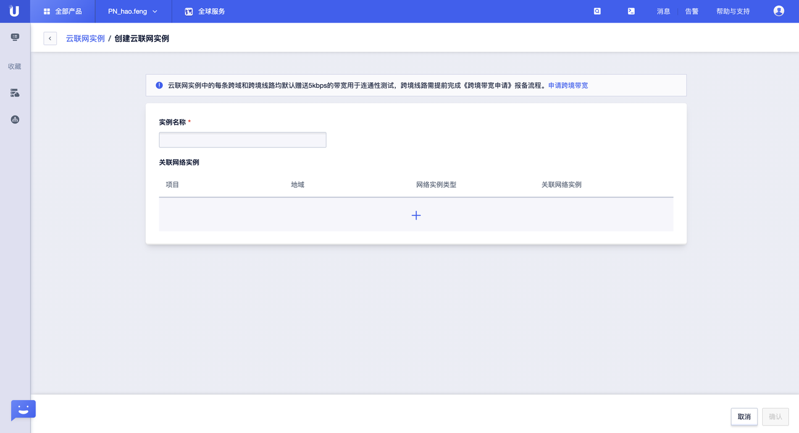

```
1、“实例名称”为必填项，可输入长度小于等于50的字符串；
2、“关联网络实例”为选填项；
```


### 管理云联网实例

点击云联网实例管理列表中的【管理云联网】按钮，即可进入云联网实例的详情管理界面；

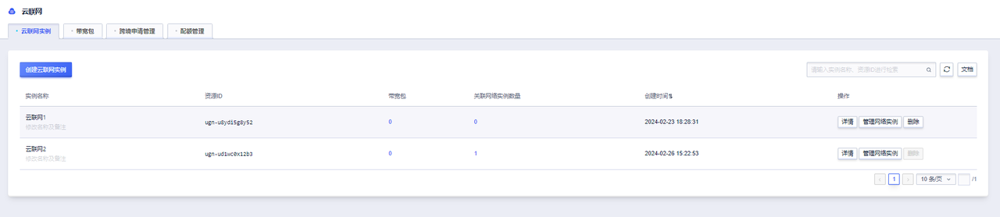


### 编辑云联网实例名称

点击云联网实例管理列表中实例名称的【修改】图标，即可进入云联网实例名称的编辑界面；

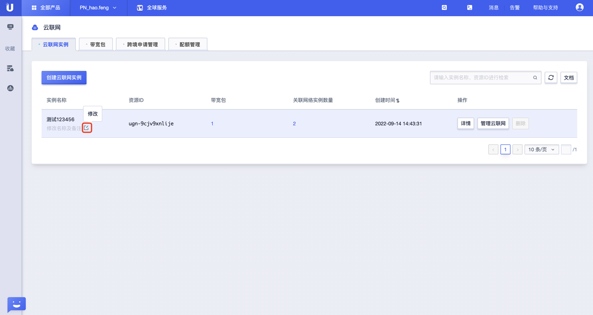


### 删除云联网

点击云联网实例管理列表中的【删除】按钮，并二次确认后，即可删除该云联网实例；

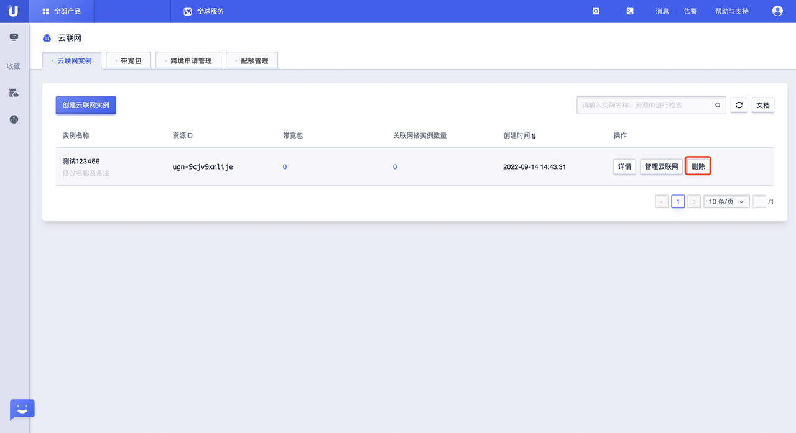

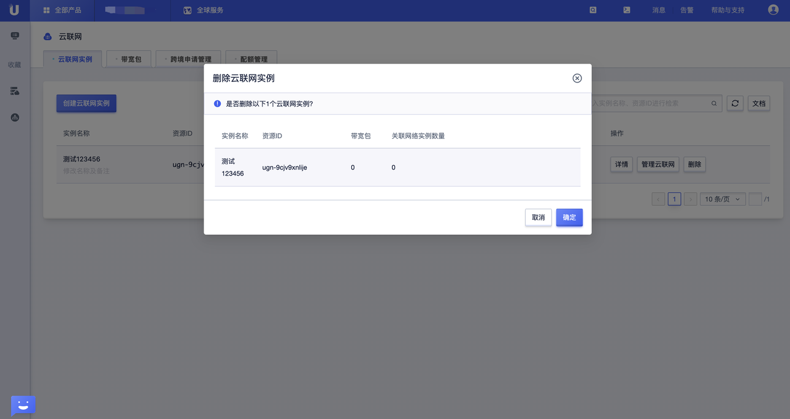

```
若当前云联网实例存在已关联的网络实例，则该云联网实例不能被删除；
```


## 关联网络实例

### 关联网络实例

第一步：在云联网实例管理界面点击【管理云联网】，选择并进入“网络实例”TAB页；

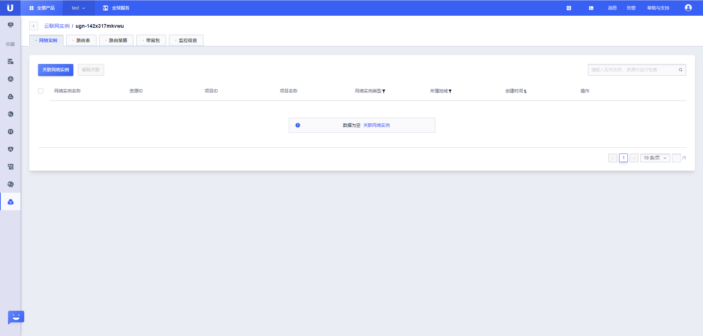


第二步：点击【关联网络实例】，选择待关联网络实例的“所属项目”、“地域”和“网络实例类型”，选中要关联的网络实例，【确认】即可；

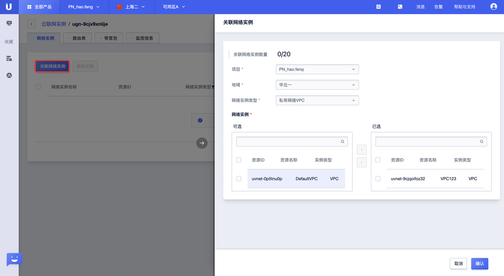


### 查看已关联网络实例

在“网络实例”TAB页，可以查看该云联网实例先关联的所有网络实例信息；

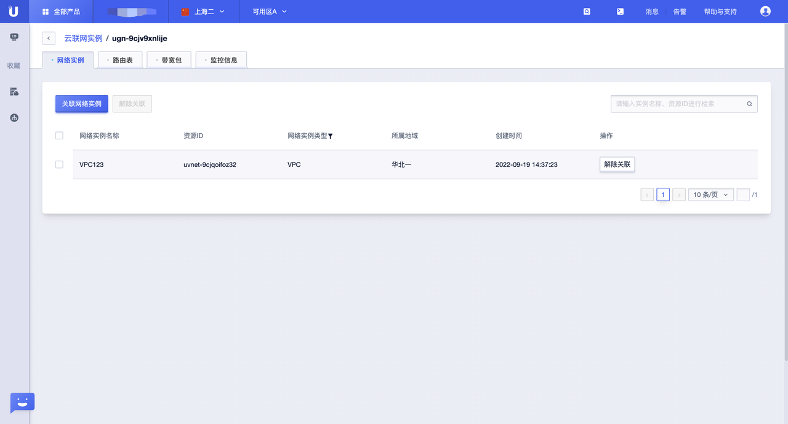


### 网络实例解除关联

用户可在“网络实例”TAB页，通过点击已关联网络实例信息条目后的【解除关联】按钮单个解除，

或者勾选中待解除关联的网络实例条目，点击界面左上角的【解除关联】进行批量解除操作；

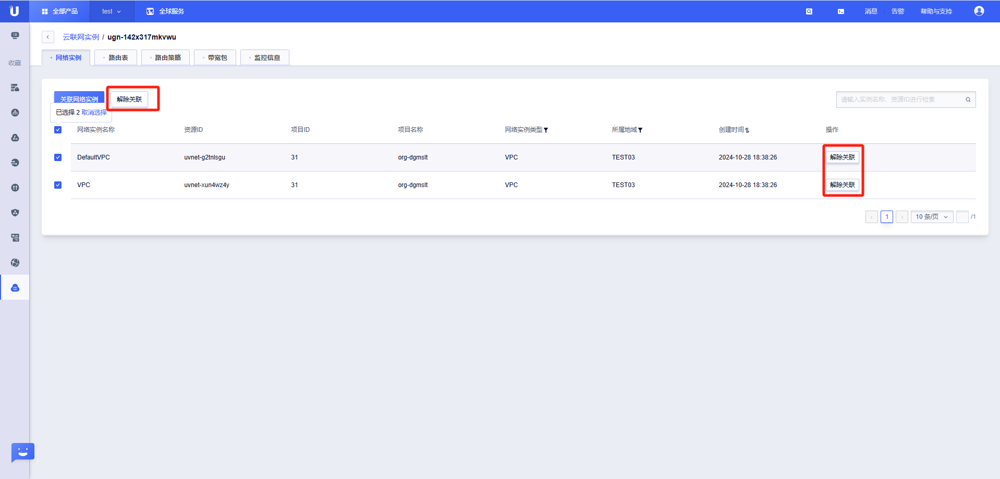

```
解除某地域下的最后一个网络实例时，需要先删除掉该地域下相关的所有带宽包；
```


## 路由表管理

### 路由表介绍

**云联网路由表：**该路由表用于展示各地域网络实例上报的路由并经过云联网出入向策略作用之后形成的真实路由表信息。


### 查看路由表

第一步：在云联网实例管理界面点击【管理云联网】，选择并进入“路由表”TAB页，该页面上会展示出相关的路由表信息；

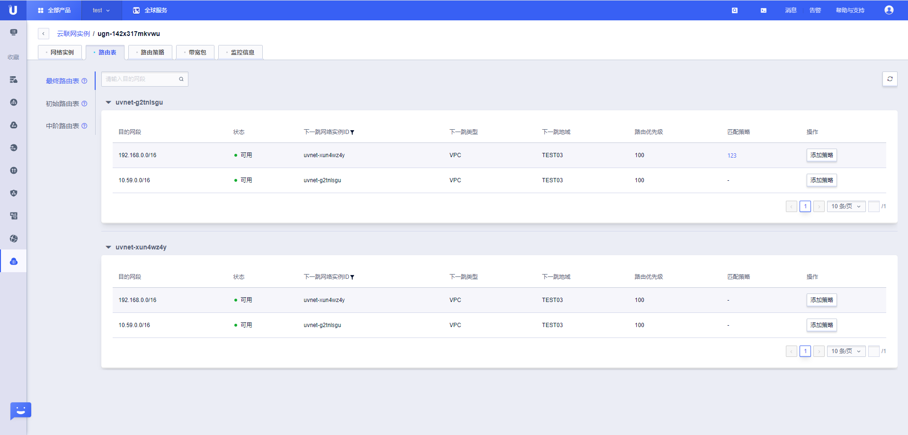

```
仅存在有效资源的路由信息才会上报至云联网并展示在“路由表”TAB页中；

eg：假如关联了某个私有网络VPC实例，但是该私有网络VPC实例并未绑定任何云主机 ，则此时认为该私有网络VPC中不存在有效资源，路由表信息将不会上报至云联网并展示在下图中；
```


### 路由表状态

**路由状态说明**

路由根据学习周期分为：有效、无效（冲突、抑制）、拒绝等状态

- **有效：**表示路由已经经过路由入向或者出向策略后依然允许接收或者可以发送的路由条目。 

- **拒绝：**表示该条路由被路由入向或者出向策略拒绝的路由条目。 

- **无效：**表示一条或者多条路由因为路由优先级相同或较低导致的路由条目无效 
  - **冲突：**一条或者多条路由因为路由优先级相同，则按照路由入数据库的先后顺序，先入库的生效，后入库的路由表状态标记为**"冲突"**
  - **抑制：**一条或者多条路由因为路由优先级较低，导致路由在路由表中竞选失败，作为备份路由，则这类路由标记为**"抑制"**

```
子网重叠原则：**

**针对接收的路由，优先检查路由的优先级**

1、路由优先级高的路由生效，低优先级不生效，路由表状态标记为"抑制"

2、路由优先级一致，则按照路由入数据库的先后顺序，先入库的生效，后入库的路由表状态标记为"冲突"

3、当一条路由被标记为"冲突"时，需要通过站内信方式通知用户。

**解决方案：**

1、通过路由策略拒收冲突的路由，启用需要通信的路由

2、通过路由策略调整重叠路由的优先级实现主备路由

3、更换网段，确保云联网通信子网网段间不重叠
```


## 带宽包管理

### 带宽包介绍

用户创建云联网并关联网络实例后，需要绑定带宽包才能正常通信；带宽包根据用户网络实例归属地域不同，可以分为**跨域带宽包**和**同域带宽包**。


### 创建带宽包

第一步：在云联网实例管理界面点击【管理云联网】，选择并进入“带宽包”TAB页，该页面上会展示出相关的带宽包表信息；

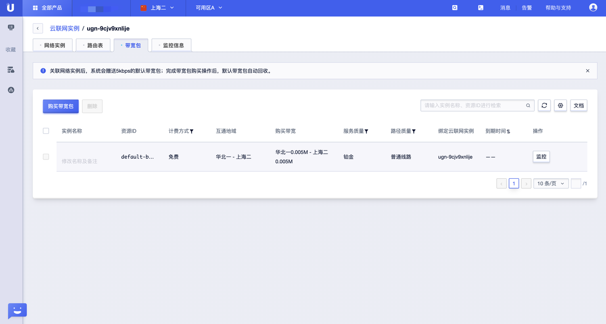


第二步：点击【购买带宽包】，填写或者选择相关参数，完成购买即可；

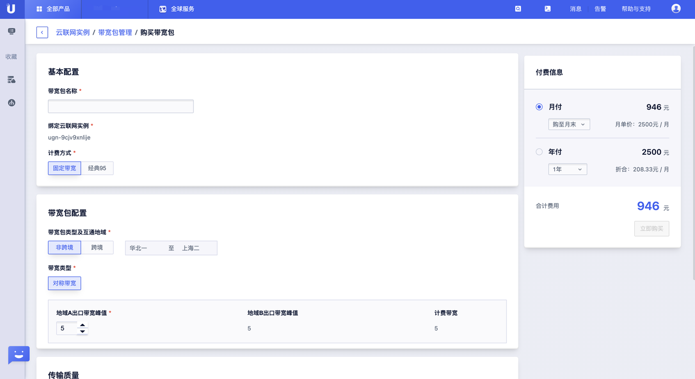


第三步：购买完成，即可在“带宽包”TAB页查看已购买的带宽包信息；

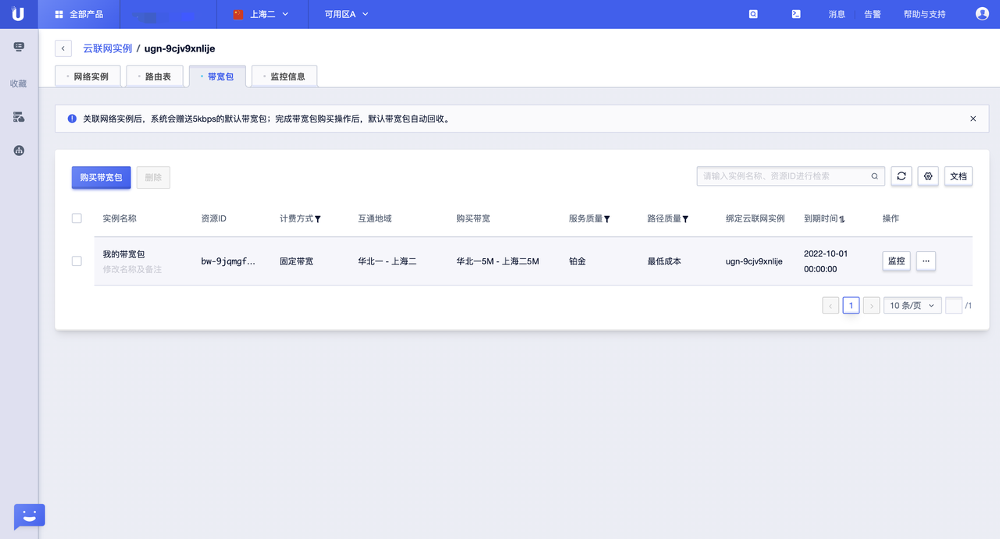

```
1、只有关联了不同地域的网络实例才能购买跨域带宽包；

2、关联至云联网实例中的任意两个地域之间的网络实例默认都会赠送5kbps的带宽包用于测试，涉及跨境的完成跨境专线报备审核后自动获得；

3、两个地域之间最多只能同时存在一个带宽包；

4、购买带宽包后，默认带宽包会自动回收；同理，删除带宽包，系统会自动赠送默认带宽包；
```


### 查看带宽包

**方法一：**在控制台上点击【全部产品】--【网络】--【云联网】--【带宽包】TAB页，进入云联网带宽包管理界面，在该界面可查看用户账号下的所有云联网实例下绑定的所有带宽包；

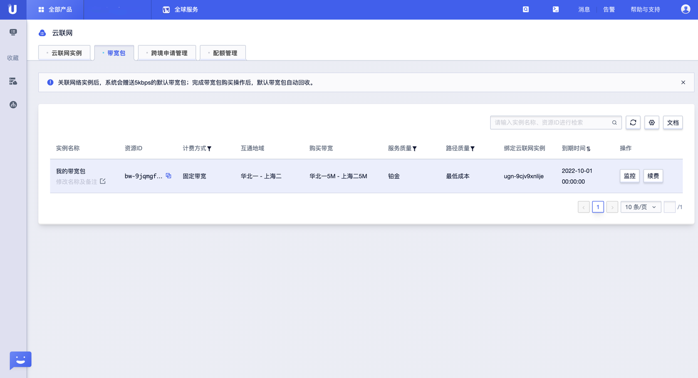


**方法二：**在云联网实例管理界面点击【管理云联网】，选择并进入“带宽包”TAB页，该页面上会展示出相关的带宽包表信息；通过该方法可查看该云联网实例下关联的带宽包；

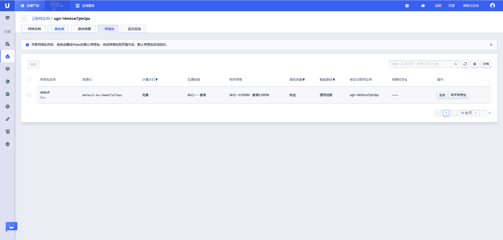


### 带宽包参数调整

控制台仅支持带宽包中带宽值升配操作，其他参数调调整请联系客户经理或者运营；


### 跨境协议

若涉及购买跨境专线，需要进行《跨境专线信息报备》，审核通过后，即可正常购买带宽包；

第一步：在控制台上点击【全部产品】--【网络】--【云联网】--【跨境申请管理】TAB页，进入跨境申请管理界面；

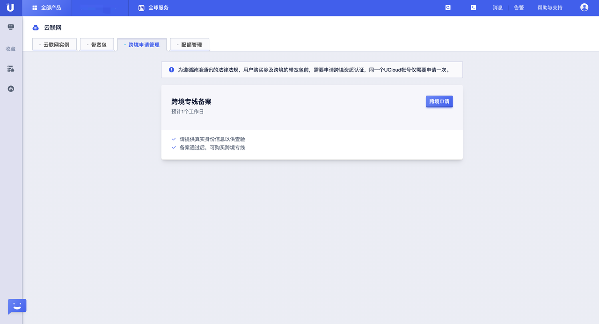


第二步：点击【跨境申请】，进入跨境申请产品界面；

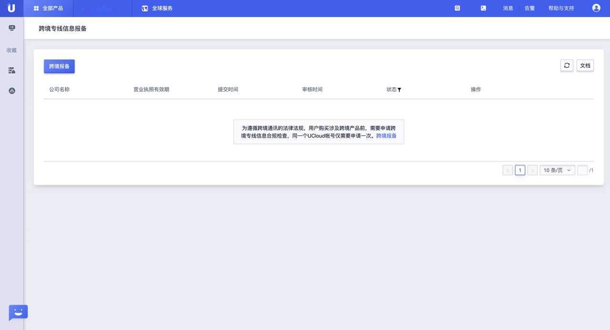


第三步：点击【跨境报备】，输入相关“企业信息”、“经办人信息”，并上传相关审核材料；


```
1、一个公司只需要报备一次即可购买多个跨境地域之间的专线；

2、报备、审核完成后就可以购买跨境带宽包；

3、报备信息更新不影响业务；
```


## 监控管理

### 监控介绍

监控管理用于监控各个带宽包下的：

- 地域出流量  

- 地域入流量  

- 地域出包量  

- 地域入包量 

  

### 查看监控信息

第一步：在云联网实例管理界面点击【管理云联网】，选择并进入“监控信息”TAB页；

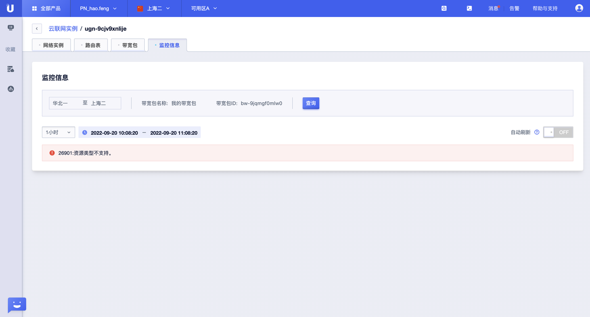

第二步：根据地域信息，筛选对应的带宽包，点击【查询】，即可查询该带宽包下：地域出/入流量、地域出/入包量的监控信息；

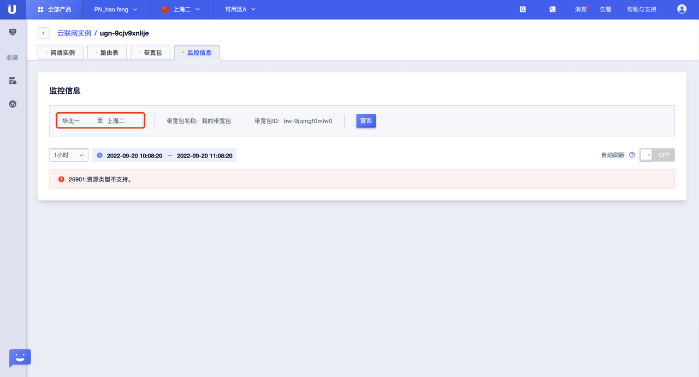

