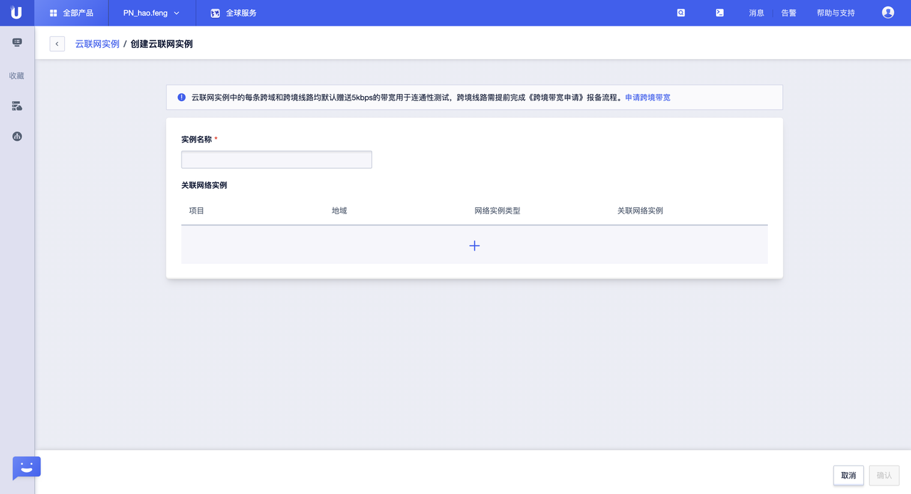
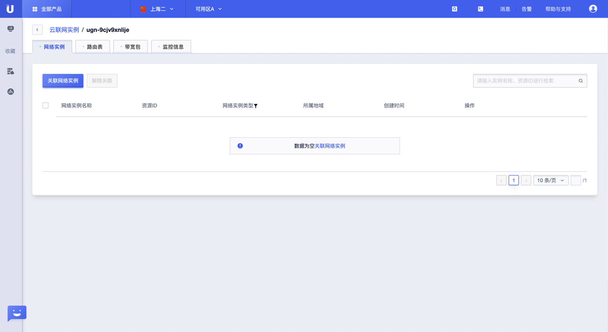
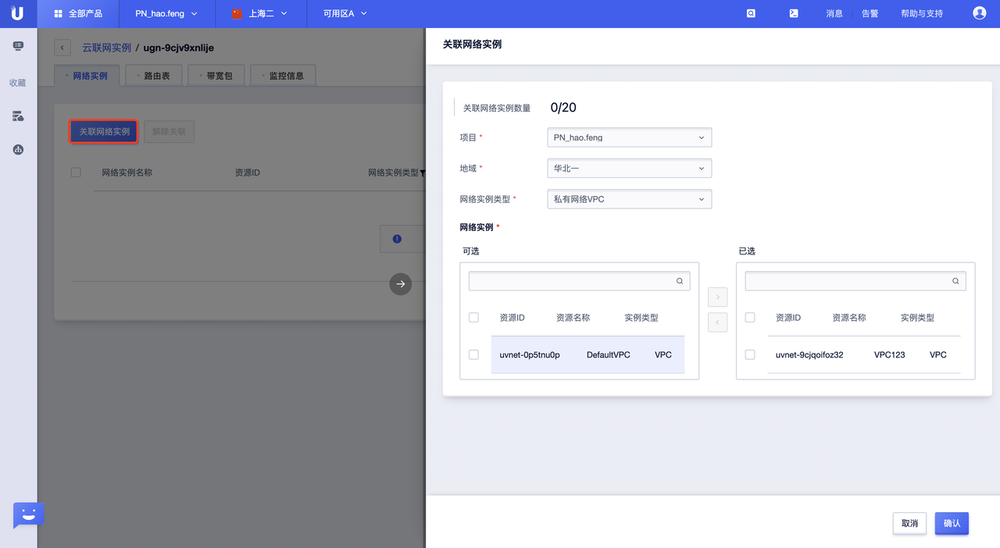
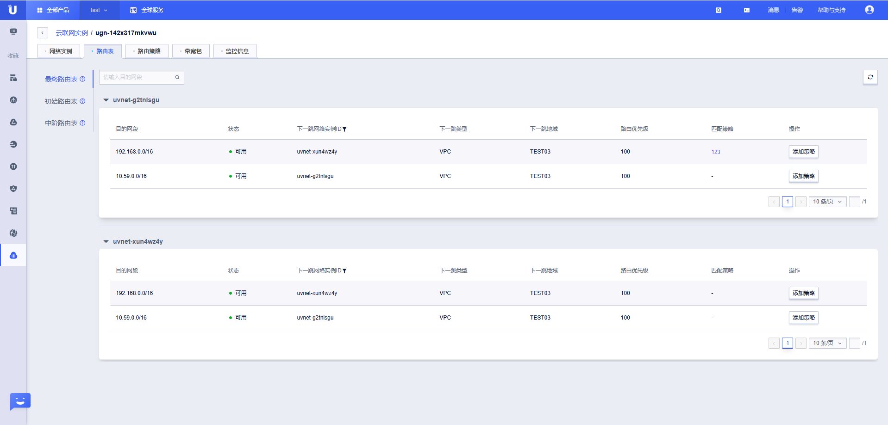
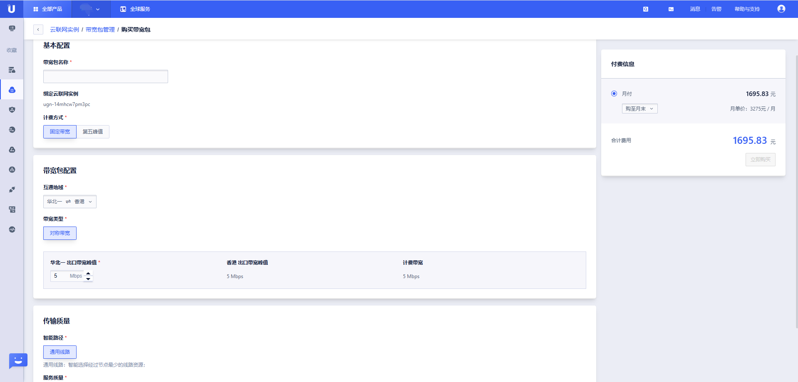
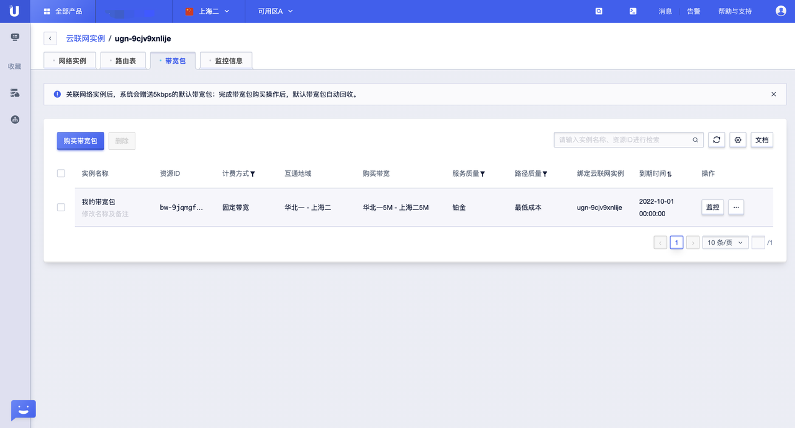

# 快速入门

## 开始使用云联网

云联网可以帮助您实现云上 VPC 间、VPC 和 云下 IDC 间的互连互通，轻松构建出一张企业级的全球网络。下文将为您介绍同账号场景下如何使用云联网。

## **同账号网络实例互通**

同账号网络实例的互通步骤如下：

### 步骤一：创建云联网实例

在控制台上点击【全部产品】--【网络】--【云联网】--【云联网实例】TAB页，进入云联网实例管理界面；

点击【创建云联网实例】，输入“实例名称”，关联相关网络实例，点击【确认】即可完成创建；

### 步骤二：关联网络实例。

在云联网实例管理界面点击【管理云联网】，选择并进入“网络实例”TAB页；

点击【关联网络实例】，选择待关联网络实例的“所属项目”、“地域”和“网络实例类型”，选中要关联的网络实例，【确认】即可；

### 步骤三：检查路由表

在云联网实例管理界面点击【管理云联网】，选择并进入“路由表”TAB页，该页面上会展示出相关的路由表信息；

### 步骤四：创建并绑定带宽包

在云联网实例管理界面点击【管理云联网】，选择并进入“带宽包”TAB页，该页面上会展示出相关的带宽包表信息；

点击【购买带宽包】，填写或者选择相关参数，完成购买即可；

购买完成，即可在“带宽包”TAB页查看已购买的带宽包信息；

### 步骤五：连通性验证

在两端的网络实例下各创建一个资源实例，并彼此互ping，如果ping通，则连通性正常；反之，则连通性异常；

## **跨账号网络实例互通（敬请期待）**