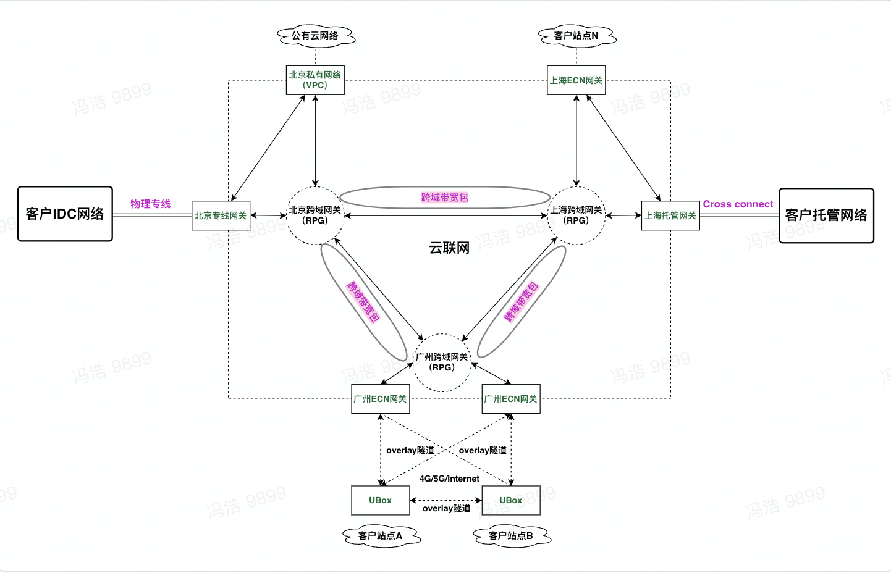

<!--一下子提供一种思路，欢迎大家发挥 -->

# 云联网产品介绍

## 产品概述

### 云联网简介

云联网（UCloud Global Network，简称UGN）是UCloud基于Segment Routing技术推出的新一代全球化网络产品，可帮助用户快速、灵活的构建出一张企业级的全球网络，实现全球全地域云上、云下网络资源互联互通。

### 云联网组成部分

云联网（UCloud Global Network，简称UGN）产品是UCloud基于Segment Routing技术推出的新一代全球化网络服务产品，实现用户不同地域VPC之间，VPC与本地数据中心、托管网络、ECN网络之间搭建云上、云下一体化的客户私有网络。帮助用户构建一张企业级的全球化网络。

云联网是项目级别产品，一个项目下可以创建多个云联网网实例；云联网实例没有地域属性，是一个全球级别产品。

- **云联网实例**

云联网实例是创建、管理一体化云上智能网络的基础资源，一个云联网实例包含关联一个或多个网络实例类型，如：**专线网关实例、托管网关实例、私有网络实例（UVPC）以及ECN网关实例**等。

- **网络实例**

云联网支持四种网络实例，实现用户云上资源互通、跨地域资源互通、云上和云下资源的互通。

**私有网络实例（UVPC）：**公有云客户自定义私有网络产品，关联云联网可以实现跨VPC、客户托管和IDC网络互通以及跨地域网络互通。

**专线网关实例：**通过专线对接用户IDC网络，关联云联网可以实现用户IDC网络访问云上VPC、托管网络以及跨地域网络互通。

**托管网关实例：**通过楼内光纤对接用户托管网络，关联云联网可以实现用户托管网络访问云上VPC、IDC网络以及跨地域网络互通。

**ECN网关实例：**ECN网关部署于UCloud 骨干网核心节点，北向对接全球骨干网，南向通过4G/5G/Internet以及专线对接到用户私有站点自用设备或者租用的UCloud UBox智能接入盒子。ECN网关实例关联云联网后，实现用户多分支站点与VPC网络、托管/IDC网络互联互通。

- **云联网路由表**

  云联网实例关联用户的网络实例后，在云联网上给用户展示一份分地域级别的路由表信息，用户在控制台上可以看到云联网路由表。

  **路由表：**此路由表展示通过各地域网络实例上报的路由信息形成的路由条目。

- **带宽包**

  用户创建云联网并关联网络实例后，需要绑定带宽包才能正常通信；带宽包根据用户网络实例归属地域不同，可以分为**跨域带宽包**和**同域带宽包**。

  **跨域带宽包**：云联网的跨域网络实例之间的网络带宽是按照**点到点**之间购买**带宽包**开通数据转发。 

  **同域带宽包（敬请期待）**：云联网的同地域网络实例之间的网络带宽是按照网络实例到网络实例之间购买带宽包开通数据转发。

  > 加入云联网中的每条线路提供5kbps的默认带宽包用于测试，跨域线路需完成跨境专线信息报备后才会获得。

### 产品功能

**全球联网：跨云跨域，全球互通**

支持UCloud全球多地域的数据中心的多节点接入，灵活快捷的打通关联到云联网实例上的网络实例；

**智能选路：多元业务，按需选择**

基于SR-TE技术实现用户业务的灵活路径选择，用户可在控制台上进行选择：低时延、通用线路、低成本；控制台上通过选择**S（Source）--->D（Destination）**地域，然后选择具体的调度路径；

- **通用线路（IGP）        ： S（Source）--->D（Destination）** 沿着最短路径进行数据转发

- **低时延线路（Delay）： S（Source）--->D（Destination）** 沿着最低时延路径进行数据转发

- **低成本线路（TCO）   ： S（Source）--->D（Destination）** 沿着最优成本路径进行数据转发

  

**带宽保障：多元业务，按需选择**

云联网产品为用户提供专线质量保障服务，同时支持：钻石（质量最优）、铂金（质量均衡）、黄金（成本敏感）三种服务质量，可根据业务灵活选择；

| **服务质量** | **说明**             | **适用场景**                           |
| :----------- | :------------------- | :------------------------------------- |
| 钻石         | 优先调度，优先转发； | 支付等网络质量要求较高的场景；         |
| 铂金         | 调度次之，转发次之； | 游戏等场景；                           |
| 黄金         | 普通调度，尽力转发； | 上传、下载等对服务质量要求一般的场景； |

**高效路由：路由自动学习，拓扑秒级收敛**

支持路由自动分发和学习，实现网络拓扑的秒级收敛；

**稳定可靠：刚性管道双平面保护**

底层架构同时提供专线骨干网和公网VPN双管道保障业务的可靠性；

各个网络接入点和转发设备采用分部署集群化部署，全网链路冗余部署，确保网络环境的高可用性；

**高易用性：一键组网，即开即用**

提供控制台WEB管理界面，支持用户直接在WEB界面上进行各种灵活的网络配置，一键组网；

**高安全性：网络隔离，专网专用**

跨境线路资质以及申请报备流程符合监管要求，公网数据传输通过隧道技术进行数据加密，保证业务流程的合规性和业务数据传输的安全性；

**灵活计费：多种计费，灵活选择**

同时支持固定带宽、增强95等多种计费方式，可灵活选择；

### 云联网和UDPN功能对比

**`云联网与VPC网络互联/UDPN区别`**

使用云联网之前，如果您想要实现同地域多个 VPC网络之间互通，需要为跨域VPC 间两两分别建立对等连接。如果您想要实现跨地域多个 VPC网络之间互通，需要为跨域VPC间两两分别建立UDPN隧道实现跨地域网络资源互通。

上述场景如果使用云联网，您只需创建一个云联网实例，将需要互联的同地域/跨地域 VPC网络加入到该云联网中，即可实现所有网络之间的互通。云联网的路由自动转发及学习，使您只需一次操作将实例加入到云联网中，无需再手动配置、管理各实例的路由表。

| **产品特性**      | **VPC网络互联/UDPN**                     | **云联网**                             |
| :---------------- | :--------------------------------------- | :------------------------------------- |
| **网络互联**      | N个VPC间全部联通需要建立Cn2条UDPN连接    | 加入云联网后实现全互联                 |
| **路由学习**      | 每条UDPN均需配置路由链路变更需要手工更新 | 路由自动学习下发动态更新，无需手工维护 |
| **包头开销**      | VXLAN+NVGRE，开销大                      | MPLS标签压缩，开销小                   |
| **刚性/弹性带宽** | 不支持                                   | 支持QoS区分服务质量                    |
| **流量工程**      | 不支持                                   | 支持最短路径、最低时延、最优成本路径   |
| **转发性能**      | sdngw单机性能差（ovs+tc)                 | P4, ovs-meter，性能大幅提高            |

### 支持地域

| **大陆资源** | 华北一（北京）、华北二（乌兰察布）、上海、广州、 |
| :----------- | :----------------------------------------------- |
| **境外资源** | **香港**                                         |

## 产品架构

### 产品模型

- 整合用户网、混合云、云网络等实现底层统一组网，统一产品；

- 云联网由网络实例、路由表、带宽包等组成；

- 全网互联，轻松管理，实现多节点路由自动学习分发；

- 基于SR-TE技术，支持通用线路、低时延、低成本等智能路径调度；

- 基于QoS服务，实现等不同品质的线路产品。

### 技术实现

- **云网融合**

每个地域网元由业务网关（VPC网关、托管/专线网关、ECN网关）和跨域网关（RPG）组成的一个整体网元结构，实现用户公有云、托管/IDC、SD-WAN网络灵活组网。

- **流量工程**

云联网底层网络通过Segment Routing （简称SR）技术简化骨干网复杂度，实现包头压缩和流量工程，支持多种路径调度能力。

- **刚性/弹性带宽**

骨干网出口位置通过部署QoS服务，实现带宽保证和弹性带宽。

- **降低转发成本**

转发面采用MPLS技术取代VXLAN+NVGRE技术，实现包头压缩，提升转发效率，降低成本。

## 产品优势

**全球灵活组网**

依托UCloud全球物理机房，快速构建云上业务网络，支持多地域、多节点、多类型、多实例的网络资源接入， 打破地域和资源形态限制，通过一体化的灵活组网实现接入网络资源之间的全球全地域线上、线下互联互通。

**差异化的产品和服务**

支持低时延、通用线路、低成本三种智能路径质量模式，支持钻石（质量最优）、铂金（质量均衡）、黄金（成本敏感）三种服务质量模式，且部分线路同时支持对称、非对称带宽，客户可根据实际业务需求和特性，自由灵活选择。

**灵活计费**

支持提供固定带宽、增强95、流量计费等多种计费方式；支持多种差异化的产品和服务；客户可根据不同业务特性，选择最适合自己的配置，保证业务质量的同时有效缩减成本。

**灵活调度和统一管理**

接入云联网中的网络资源可以基于SR技术进行灵活调度，满足多种客户不同的业务需求，同时支持提供统一的可视化管理界面。

## 应用场景

###  云上跨域资源互访

公有云资源遍布全球，服务之间需要实现逻辑互联互访，业务数据传输和客户业务直接相关，需要保证数据的保密性、安全性和传输可靠性。同时需要支持对业务的灵活配置、切换、访问控制等高效运维工作场景。

**解决方案**

- 多地域部署VPC实例；

- 部署云联网实例 ，加载全球VPC实例，构建跨地域访问；

- 智能选路服务支持用户选择最低时延避免绕行网络带来业务受损；

### **云上同域资源互访**

同地域多个服务之间需要实现逻辑互联互访，业务数据传输和客户业务直接相关，需要保证数据的保密性、安全性和传输可靠性。同时需要支持对业务的灵活配置、切换、访问控制等高效运维工作场景。

**解决方案**

- 单地域部署多个VPC实例；

- 部署云联网实例 ，加载该地域内全部VPC实例，构建同地域VPC访问；

- 智能选路服务支持用户选择最低时延避免绕行网络带来业务受损；

### 云下跨域资源互访

 业务面向全球或分支机构、门店建于当地；自建或者租用当地物理设备，业务节点之间需要实现FULL-MESH互联访问。需要保证数据的保密性、安全性和传输可靠性。同时需要支持业务弹性、降低繁琐的人力管理成本；

**解决方案：**

- 客户多地接入托管IDC业务连接托管网关；

- 云联网向客户提供智能接入盒子帮助客户组建当地分支机构、小站点的ECN/VPN网络；

- 部署云联网实例 ，加载全球各类型网关实例，就近接入云联网；

### 混合组网资源互访

 业务遍及全球； 部分业务本地传统部署，部分业务云上部署 ，业务节点之间FULL-MESH互联访问。对于核心业务有较高的传输要求，对于备份、离线数据传输要求不高，保证保密性、安全性和传输可靠性同时需要支持本地扩展弹性、降低繁琐的人力管理成本

**解决方案**

- 部署云联网实例 ，加载全球各类型网关实例；

- 即时组建各类资源及网关实例：私有网络（VPC）实例、专线网关实例、托管网关实例、ECN网关（SD-WAN接入）实例；

- 根据复杂业务配置路由策略；

- 开通反向带宽、选择不同服务等级带宽、配置不同的路由策略降低地缘性成本，大幅提升业务性能和服务质量；

## 使用限制

### **产品配额限制**

### **路由限制**

由于云联网可以使多网络实例互通，为使各实例间顺利互通，对网络实例的 CIDR 会有一定限制：

**VPC** **的 CIDR 限制**

云联网在子网层面设置 CIDR 限制，即不同 VPC 中两个 CIDR 完全相同的子网无法实现互通，路由生效规则请见下文中 CIDR 重叠冲突原则。相应的，即使两个 VPC 的 CIDR 重叠 ，但若其包含子网的 CIDR 不同，仍可以加入云联网并实现互通。

**CIDR 重叠冲突原则**

**针对接收的路由，优先检查路由的优先级：**

1. 路由优先级高的路由生效，低优先级不生效，路由表状态标记为"抑制"；

1. 路由优先级一致，则按照路由入数据库的先后顺序，先入库的生效，后入库的路由表状态标记为"冲突"；

1. 当一条路由被标记为"冲突"时，需要通过站内信方式通知用户。

**解决方案：**

1. 通过路由策略拒收冲突的路由，启用需要通信的路由；

1. 通过路由策略调整重叠路由的优先级实现主备路由；

1. 更换网段，确保云联网通信子网网段间不重叠。

   

### 产品调配限制

1. 带宽包调整

控制台上默认只允许用户进行【带宽值升配】 和 【删除带宽包】操作，需要调整带宽包其他参数，请提交工单或者联系客户经理；

### **其他使用限制**

1. 一个云联网实例下可关联当前登录账号下所有可见的网络实例ID（支持跨账号、跨项目）；

2. 一个云联网实例可关联多个网络实例类型或者多个网络实例ID；

3. 一个网络实例ID只能同时关联一个云联网实例；

4. 若要解除一个地域下关联的所有网络实例ID，则必须先确保不存在该地域下的带宽包；

5. 两个地域之间最多有且仅有一个带宽包，且一个带宽包只能同时绑定一个云联网实例；

6. 未通过《跨境专线合规检查》审核的用户，无法购买和创建任何跨境带宽包（默认带宽包&自定义带宽包）；

7. 不允许购买、创建一个无正常业务流量运行的带宽包；

8. 创建带宽包的两个前提条件：

   带宽包的相关地域存在正常状态的网络实例ID，且该网络实例ID已成功关联云联网实例；

   带宽包必须关联一个正常运行的云联网实例；

