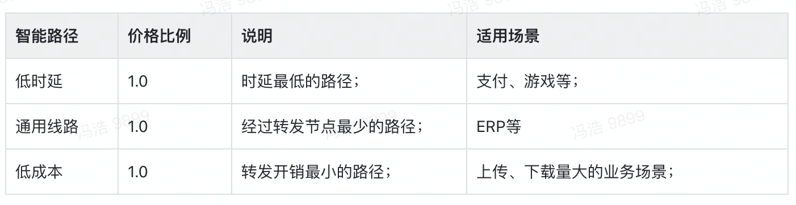
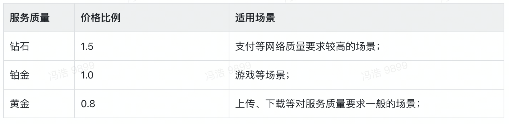
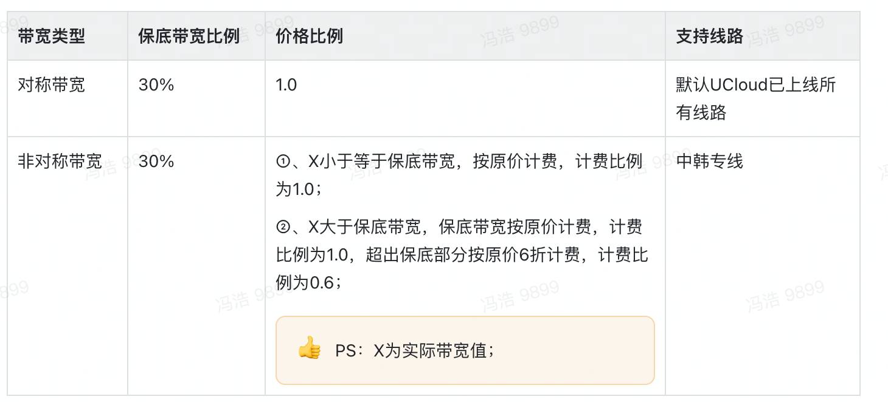
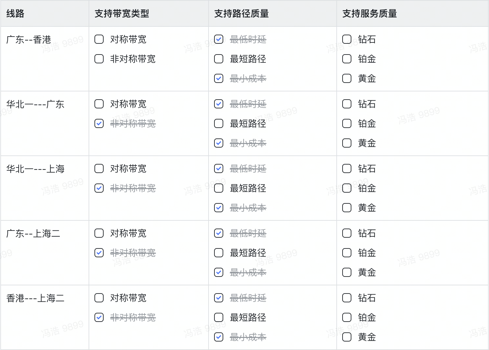

# 购买指南

## **计费项**

## **计费模式**

## **计费比例**

**智能路径价格比例**

**服务质量价格比例**

**带宽类型说明**

**UCloud支持线路**

## **固定带宽**

### 计费方式

计费方式：预付费方式；

### 计费周期

以月/年为单位，购买时立即生成账单；

### 计费算法

总带宽费用=带宽包固定带宽*产品月单价（*有效天数/计费月天数）；

- 若月内带宽包中有带宽的升降级调整，则在调整这个时间节点之前的还是按照原固定带宽进行计费，之后的按照新的固定带宽进行计费，同时产生对应的退费/补缴操作；

- 计费时间的颗粒度精确到小时，不足一小时的按一小时计算；

- 若用户购买周期不是整数自然月，则当月的最终带宽费用=原带宽费用*有效天数/计费月天数进行折算；

## **增强95**

### 计费方式

计费方式：后付费方式；

### 计费周期

以月/年为单位，每月末最后一天12点生成当月账单；

### 计费算法

总带宽费用=计费带宽 * 产品月单价 * 有效天数 / 计费月天数；

- **日峰值：**每5分钟分别统计1个出、入带宽的均值作为峰值，然后将较大值作为1个有效带宽峰值点，每日288个统计点，降序排列后取第5大峰值作为当日的带宽日峰值。

- **月峰值：**结算日将所取的日峰值降序排列，取前5个日峰值的带宽均值作为月峰值。

- **保底带宽**：用户设置带宽峰值之后，系统会根据保底比率自动计算出保底带宽。

- **计费带宽**：若当月月峰值带宽小于保底带宽，则最终计费带宽按照保底带宽值计算；反之，则计费带宽按照当月月峰值带宽值进行计费。

- **有效天数：**带宽大于5kbps的天数。

- **计费月天数：**为带宽包使用月当月的实际天数。

## **流量计费**

### 计费方式

计费方式：后付费方式；

### 计费周期

最小计费时长单位为天，当天12点，生成当日账单；

### 计费算法

总费用=实际使用流量*流量单价

- 按照实际使用，统计两端出向流量；

- 流量统计最小颗粒度为MB，不足1MB的按1MB处理；

## 欠费回收处理逻辑

- ### 固定带宽

1）购买的时候生成账单，并进行扣费操作；

2）若客户开启了“自动续费”，下个扣费日如果账号余额不足，系统会发送站内新通知续费；用户欠费超过3天，带宽包资源会进入“停服列表”，将带宽包中线路带宽限速调整为5kbps；

3）用户欠费超过7天，带宽包资源会进入“待回收列表”，并删除所有对应的带宽包资源和配置参数；

- ### 增强95

1）本月最后一个自然日的12点生成本月账单，并进行扣费操作；

2）若用户账号余额不足，系统会发送站内新通知续费；用户欠费超过3天，带宽包资源会进入“停服列表”，将带宽包中线路带宽限速调整为5kbps；

3）用户欠费超过7天，带宽包资源会进入“待回收列表”，并删除所有对应的带宽包资源和配置参数；

- ### 流量计费

1）每天的12点生成当天账单，并进行扣费操作；

2）若用户账号余额不足，系统会发送站内新通知续费；用户欠费超过3天，带宽包资源会进入“停服列表”，将带宽包中线路带宽限速调整为5kbps；

3）用户欠费超过7天，带宽包资源会进入“待回收列表”，并删除所有对应的带宽包资源和配置参数；