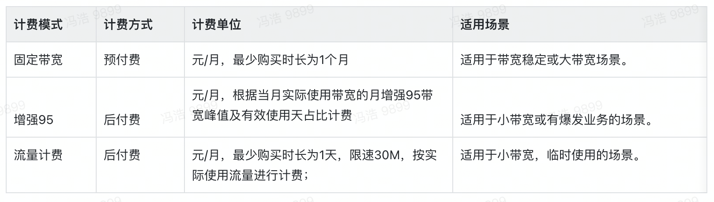

# 购买指南

## **计费项**

## **计费模式**

## **计费比例**

**智能路径价格比例**

**服务质量价格比例**

**带宽类型说明**

**UCloud支持线路**

## **固定带宽**

### 计费方式

计费方式：预付费方式；

### 计费周期

以月/年为单位，购买时立即生成账单；

### 计费算法

总带宽费用=带宽包固定带宽 * 产品月单价 *（有效天数/计费月天数） *  智能路径系数  *  服务质量系数  *  带宽类型系数；

- 若月内带宽包中有带宽的升降级调整，则在调整这个时间节点之前的还是按照原固定带宽进行计费，之后的按照新的固定带宽进行计费，同时产生对应的退费/补缴操作；

- 计费时间的颗粒度精确到小时，不足一小时的按一小时计算；

- 若用户购买周期不是整数自然月，则当月的最终带宽费用=原带宽费用 x 有效天数/计费月天数进行折算；

### 计费示例

例如：客户A，于8月5日上午10点半购买了从北京到上海300M的固定带宽，智能路径为低时延，服务质量为铂金的对称带宽，产品的月单价为200元/M/月，则客户A本月账单为：

固定带宽为：300M；        

产品月单价为：200元/M/月；     

当月有效时间系数为：26.58/31=0.86    （8月份总共31天，用户8月5日上午10点半购买的，不足一小时按1小时结算，客户的实际使用时长=8月5日这天从10点开始计费至24点+8月6日至8月31日全天，总共26天14小时）

智能路径系数为：1；  

 服务质量系数为：1；    

带宽类型系数为：1；

本月实际账单为：300 * 200*（26.58/31） *  1 * 1 * 1=51600元

 

## **增强95**

### 计费方式

计费方式：后付费方式；

### 计费周期

以月/年为单位，每月末最后一天12点生成当月账单；

### 计费算法

1）.若实际计费带宽小于等于保底带宽；

总带宽费用=保底带宽 * 产品月单价 * （有效天数 / 计费月天数）* 智能路径系数 * 服务质量系数 * 带宽类型系数；

2）.若实际计费带宽大于保底带宽；

总带宽费用=保底带宽 * 产品月单价 * （有效天数 / 计费月天数）* 智能路径系数 * 服务质量系数 * 对称带宽系数+超保底带宽 * 产品月单价 * （有效天数 / 计费月天数） * 智能路径系数 * 服务质量系数 * 非对称带宽系数；

- **日峰值：**每5分钟分别统计1个出、入带宽的均值作为峰值，然后将较大值作为1个有效带宽峰值点，每日288个统计点，降序排列后取第5大峰值作为当日的带宽日峰值。

- **月峰值：**结算日将所取的日峰值降序排列，取前5个日峰值的带宽均值作为月峰值。

- **保底带宽**：用户设置带宽峰值之后，系统会根据保底比率自动计算出保底带宽。

- **计费带宽**：若当月月峰值带宽小于保底带宽，则最终计费带宽按照保底带宽值计算；反之，则计费带宽按照当月月峰值带宽值进行计费。

- **有效天数**：自开通业务起至账单结算时刻的天数。

- **计费月天数：**为带宽包使用月当月的实际天数。

### 计费示例

例如：客户A，于8月5日上午10点半购买了从北京到上海300M的增强95计费带宽，默认保底带宽比例为30%，智能路径为低时延，服务质量为铂金的对称带宽，带宽类型为非对称带宽，产品的月单价为300元/M/月，客户本月月峰值带宽为150M，则客户A本月账单为：

保底带宽为：100M；     

产品月单价为：300元/M/月 ；               

当月有效天数为：客户8月5日开通的业务，所以有效天数从8月5日到8月31日，共27天；

智能路径系数为：1；  

服务质量系数为：1； 

 非对称带宽保底系数为1，超保底系数为0.6；

本月实例账单为：100 * 300 * （27/31） * 1 * 1 * 1+(150-100) * 300 * (27/31) * 1 * 1 * 0.6=33930元

## **流量计费**

### 计费方式

计费方式：后付费方式；

### 计费周期

最小计费时长单位为天，当天12点，生成当日账单；

### 计费算法

总费用=实际使用流量*流量单价

- 按照实际使用，统计两端出向流量；

- 流量统计最小颗粒度为MB，不足1MB的按1MB处理；

### 计费示例

例如：客户A，于8月5日上午10点半购买了从北京到上海30M的流量计费带宽，产品的单价为50元/M月，今天北京出口流量为100.35M，上海的出口流量为50.2M，则客户A今天账单为：

今日使用流量为：100.35+50.2=150.55M，不足1M按1M处理，实际计费流量为151M；

今日账单为：151*50=7550元；

## 欠费回收处理逻辑

- ### 固定带宽

1）购买的时候生成账单，并进行扣费操作；

2）若客户开启了“自动续费”，下个扣费日如果账号余额不足，系统会发送站内新通知续费；用户欠费超过3天，带宽包资源会进入“停服列表”，将带宽包中线路带宽限速调整为5kbps；

3）用户欠费超过7天，带宽包资源会进入“待回收列表”，并删除所有对应的带宽包资源和配置参数；

- ### 增强95

1）本月最后一个自然日的12点生成本月账单，并进行扣费操作；

2）若用户账号余额不足，系统会发送站内新通知续费；用户欠费超过3天，带宽包资源会进入“停服列表”，将带宽包中线路带宽限速调整为5kbps；

3）用户欠费超过7天，带宽包资源会进入“待回收列表”，并删除所有对应的带宽包资源和配置参数；

- ### 流量计费

1）每天的12点生成当天账单，并进行扣费操作；

2）若用户账号余额不足，系统会发送站内新通知续费；用户欠费超过3天，带宽包资源会进入“停服列表”，将带宽包中线路带宽限速调整为5kbps；

3）用户欠费超过7天，带宽包资源会进入“待回收列表”，并删除所有对应的带宽包资源和配置参数；